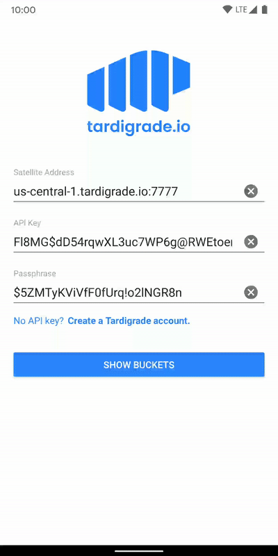

# Tardigrade-Android
This is a proof of concept app demonstrating some capabilities of [Tardigrade](https://tardigrade.io/)- the world's first S3-compatible SLA-backed decentralized cloud storage solution. Tardigrade is a product of [Storj Labs](https://storj.io/) which has built client libraries to allow Tardigrade access. This app uses the [uplink-android](https://github.com/storj/uplink-android) library but there are also libraries available in [Go](https://github.com/storj/uplink), [Python](https://pypi.org/project/storjPython/), [Swift](https://github.com/utropicmedia/storj-swift), and [Node.js](https://github.com/utropicmedia/storj-nodejs).

## Disclaimer
This app is no way affiliated with Storj Labs. The Fullsend team built this as an opportunity to play with new tech and support an interesting project. This app only allows users to explore buckets and download files. It is very limited and is missing features like basic error handling.

## Demo

